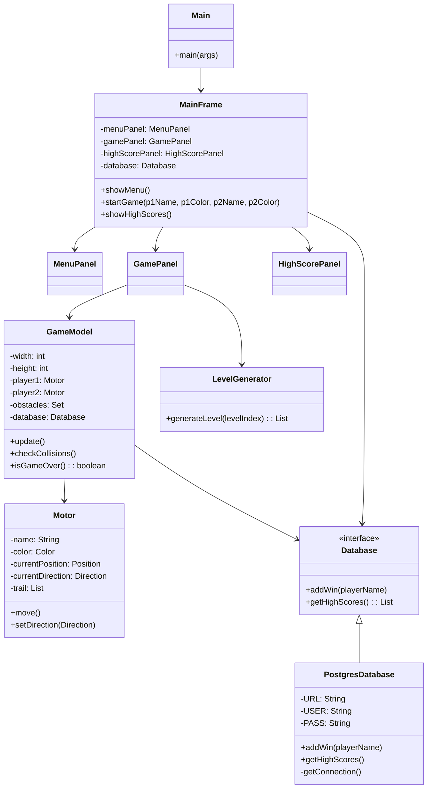

# Tron Game Documentation

## 1. Task Description
The goal was to create a "Tron" light-cycle game where two players compete on a 2D grid. Each player controls a motorcycle that leaves a trail. If a player hits a wall, their own trail, or the opponent's trail, they lose. The game must include:
- Two-player local multiplayer (WASD vs Arrow Keys).
- Timer to track game duration.
- Database to store high scores (Top 10).
- Level generation (obstacles).
- GUI using simple graphics.

## 2. Analysis
The problem can be modeled as a grid-based simulation.
- **State**: The game state consists of the grid dimensions, the position and direction of both players, and a set of static obstacles (walls).
- **Update Loop**: The game proceeds in discrete time steps (ticks). In each tick, players move one step in their current direction.
- **Collision**: After movement, we check if a player's new position overlaps with:
    - Game boundaries (0 <= x < width, 0 <= y < height)
    - Static obstacles
    - Any visited position in either player's trail history.
- **Persistence**: Player wins are stored in a PostgreSQL database (Docker container). The game connects via JDBC to `jdbc:postgresql://localhost:5432/tron`, using table `results(player_name, score)`. The application manages connection and executes INSERT/UPDATE queries.

## 3. Structure (UML Class Diagram)

## 4. Implementation Details
### Game Loop
The game loop is driven by a `javax.swing.Timer` in `GamePanel`. Every 100ms, the `actionPerformed` method is called, which triggers `GameModel.update()`. This separates the rendering rate from the logic update rate, though in this simple implementation they are coupled (repaint follows update).

### Collision Detection
Collision detection is handled in `GameModel.checkCrash(Motor player)`. It checks:
1.  **Bounds**: Simple coordinate comparison against width/height.
2.  **Obstacles**: Hash lookup in `Set<Position> obstacles` (O(1)).
3.  **Trails**: Iteration through the coordinate history of both players.

### Input Handling
`GamePanel` uses a `KeyListener`. Key presses update the `currentDirection` of the respective `Motor`. To prevent suicide, 180-degree turns are ignored (e.g., cannot go DOWN if currently going UP).

### Database
The `PostgresDatabase` uses JDBC to connect to a PostgreSQL instance. It executes SQL queries (`INSERT ... ON CONFLICT` for updates, `SELECT ... ORDER BY` for highscores). The JDBC driver `postgresql-42.7.2.jar` must be present in the classpath.
